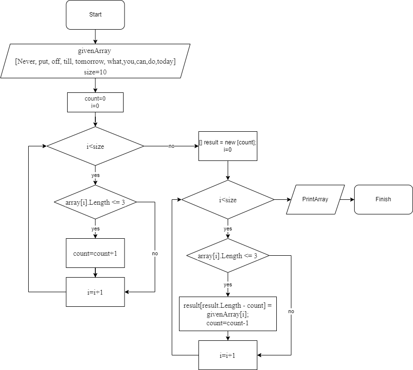

# Итоговая проверочная работа

## ***Задание***

Написать программу, которая из имеющегося массива строк формирует массив из строк, длина которых меньше либо равна трём символам. Первоначальный массив можно ввести с клавиатуры, либо задать на старте выполнения алгоритма. При решении не рекомендуется пользоваться коллекциями, лучше обойтись исключительно массивами.

`Примеры результатов работы программы:`

```
["hello", "2", "world", ":-)"] -> ["2", ":-)"]

["1234", "1567", "-2", "computer science"] -> ["-2"]

["Russia", "Denmark", "Kazan"] -> []
```
## ***Алгоритм программы***

Нам дан массив строк "Never", "put", "off", "till", "tomorrow", "what", "you", "can", "do", "today".
Так как по условию нам необходимо сформировать новый массив, то сначала определим длину будущего массива. Для этого введем переменную count и посчитаем количество строк, длина которых меньше либо равна трём символам. Для этого запустим цикл и пройдемся по всем элементам данного массива. Если условие выполняется, то увеличиваем count на единицу, если условие не выполняется, то проверяем следующий элемент, и т.д. пока не проверим последний элемент и выйдем из цикла.
Далее формируем новый массив, состоящий из строк, длина которых удовлетворяет условию задания. Для этого цикле for проходимся по каждой строчке массива. Если длина строки больше или равна 3, то в новый массив записывается данная строка и count уменьшаем на единицу. Проверяем каждый элемент, пока не прйдемся по всем элементам и не выйдем из цикла.
Печатаем новый массив.


